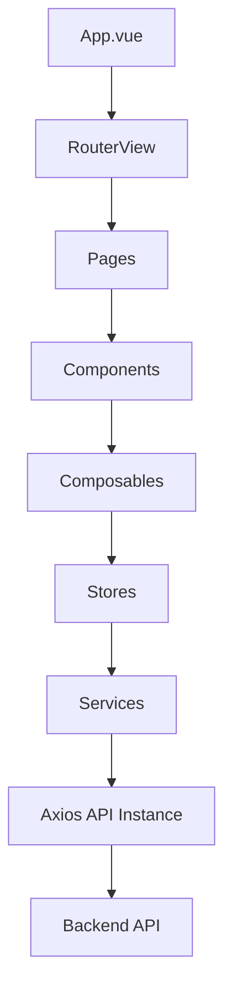
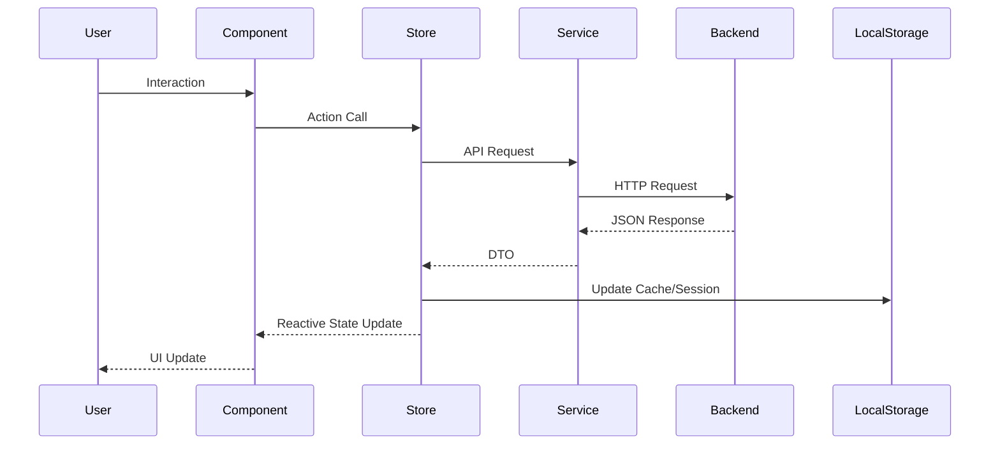
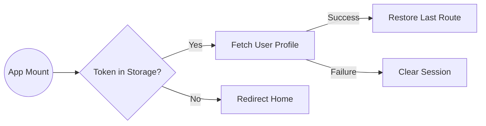

### Architecture & Tech Stack

This document outlines the technical foundation of the EventPlanner UI.

#### Tech Stack

- **Framework**: [Vue 3](https://vuejs.org/) (Composition API)
- **State Management**: [Pinia](https://pinia.vuejs.org/)
- **Styling**: [Tailwind CSS](https://tailwindcss.com/)
- **UI Components**: [PrimeVue](https://primevue.org/)
- **Form Management**: [Vee-Validate](https://vee-validate.logaretm.com/v4/) & [Zod](https://zod.dev/)
- **Routing**: [Vue Router](https://router.vuejs.org/)
- **HTTP Client**: [Axios](https://axios-http.com/)
- **Testing**: [Vitest](https://vitest.dev/) (Unit) & [Playwright](https://playwright.dev/) (E2E)

#### Application Architecture

The project follows a modular and clean architecture pattern:

- **Stores**: Centralized state management using Pinia. Logic is often extracted into outer-scope helper functions for better performance and testability.
- **Composables**: Encapsulated reusable logic, especially for form management and complex data transformations.
- **Services**: Abstracted API communication layer.
- **Schemas**: Domain-driven Zod schemas for validation and type safety.

#### Data Flow & Persistence

#### Authentication Flow

EventPlanner implements a robust re-hydration strategy to prevent unnecessary redirects and ensure a smooth user experience.

